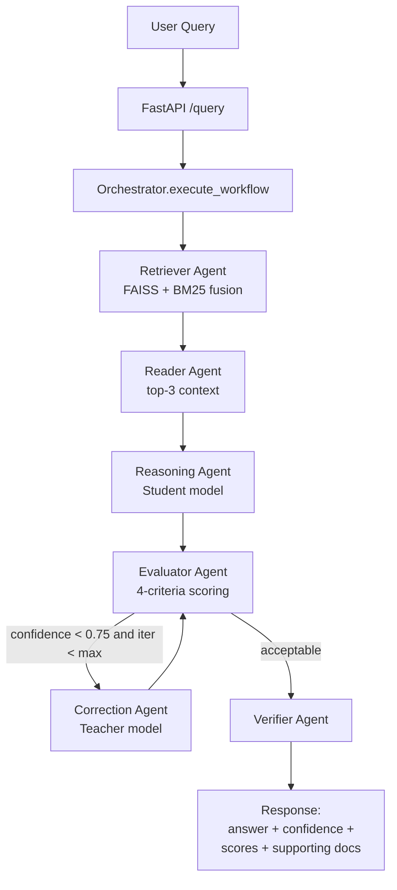

# Self-Correcting Financial Intelligence System
## A Multi-Agent Retrieval-Augmented Generation Pipeline with Teacher–Student Distillation and Evaluator-in-the-Loop Self-Correction

**Project Type:** M.Tech Dissertation / Technical Report
**System Version:** 1.0.0
**Domain:** Enterprise Financial Analytics · Natural Language Processing · Applied Machine Learning

---

## Table of Contents

1. [Abstract](#1-abstract)
2. [Introduction](#2-introduction)
3. [Problem Statement and Objectives](#3-problem-statement-and-objectives)
4. [Background and Related Techniques](#4-background-and-related-techniques)
5. [System Architecture](#5-system-architecture)
6. [Detailed Module Design](#6-detailed-module-design)
7. [Algorithms and Mathematical Formulation](#7-algorithms-and-mathematical-formulation)
8. [End-to-End Data Flow](#8-end-to-end-data-flow)
9. [Configuration Reference](#9-configuration-reference)
10. [Backend API Specification](#10-backend-api-specification)
11. [Frontend Design](#11-frontend-design)
12. [Deployment Architecture](#12-deployment-architecture)
13. [Evaluation Methodology](#13-evaluation-methodology)
14. [Technology Stack](#14-technology-stack)
15. [Limitations and Future Work](#15-limitations-and-future-work)
16. [Glossary](#16-glossary)
17. [References](#17-references)

---

## 1. Abstract

The **Self-Correcting Financial Intelligence System** is an end-to-end, multi-agent
Retrieval-Augmented Generation (RAG) pipeline designed to answer complex financial
questions over enterprise data sources such as SEC EDGAR filings and a Snowflake data
warehouse. The system addresses two persistent weaknesses of large-language-model (LLM)
based question answering in the financial domain: **hallucination** (ungrounded answers)
and the **cost–accuracy trade-off** between large and small models.

To mitigate hallucination, the system grounds every answer in retrieved evidence using a
**hybrid retriever** that fuses dense semantic search (FAISS) with sparse lexical search
(BM25). To balance cost and accuracy, it employs **teacher–student knowledge distillation**,
where a large teacher model (GLM-130B) guides a fast student model (Mistral-7B); the student
serves the default fast path, while the teacher is invoked only during correction loops.
A dedicated **evaluator agent** scores each answer on four criteria (relevance, factual
consistency, numerical coherence, and entailment) and triggers automatic **self-correction**
when confidence falls below threshold. The whole process is coordinated by a
**LangGraph-style multi-agent orchestrator** that maintains a shared workflow state and
performs conditional routing between agents.

The system is delivered as a production-style stack: a **FastAPI** backend exposing REST
endpoints, a **Streamlit** analytics frontend, and a **Docker Compose** deployment that
includes Redis caching and Prometheus/Grafana monitoring.

---

## 2. Introduction

Financial analysts routinely answer questions that require synthesising information across
heterogeneous sources — regulatory filings, earnings calls, balance sheets, and market data.
General-purpose LLMs can phrase fluent answers but frequently fabricate figures or cite
non-existent facts, which is unacceptable in a domain where numerical precision and
traceability are mandatory.

This project implements a system that treats answer generation as a **verifiable,
self-correcting process** rather than a single forward pass. Each answer is retrieved,
reasoned, evaluated, and (if necessary) corrected before being returned with a confidence
score and a list of supporting documents. The design demonstrates several applied ML
concepts in an integrated setting: hybrid information retrieval, knowledge distillation,
multi-agent orchestration, and automated evaluation.

---

## 3. Problem Statement and Objectives

### 3.1 Problem Statement

> Build a system that answers natural-language financial questions accurately and
> traceably over enterprise data, automatically detecting and correcting low-quality
> answers, while keeping inference cost low enough for interactive use.

### 3.2 Objectives

| # | Objective | How It Is Addressed |
|---|-----------|---------------------|
| O1 | Ground answers in real evidence to reduce hallucination | Hybrid FAISS + BM25 retrieval over ingested documents |
| O2 | Balance accuracy and latency | Teacher–student distillation; student is the fast default |
| O3 | Quantify answer quality | Multi-criteria evaluator producing a single confidence score |
| O4 | Automatically improve weak answers | Evaluator-in-the-loop correction with the teacher model |
| O5 | Provide traceability | Supporting documents, evaluation scores, and iteration counts returned per query |
| O6 | Be production-deployable | FastAPI + Streamlit + Docker Compose + monitoring |

---

## 4. Background and Related Techniques

### 4.1 Retrieval-Augmented Generation (RAG)

RAG augments an LLM with an external retrieval step so that generation is conditioned on
retrieved evidence rather than only on parametric memory. This reduces hallucination and
allows the knowledge base to be updated without retraining the model.

### 4.2 Hybrid Retrieval (Dense + Sparse)

- **Dense retrieval (FAISS):** Embeds queries and documents into a shared vector space and
  retrieves by nearest-neighbour search. Captures *semantic* similarity (e.g., "revenue
  growth" ≈ "increase in sales").
- **Sparse retrieval (BM25):** A probabilistic bag-of-words ranking function that rewards
  exact term overlap. Strong on *lexical* matches such as ticker symbols, statute numbers,
  and precise financial terminology.
- **Fusion:** A weighted linear combination of the two scores leverages the complementary
  strengths of both methods.

### 4.3 Knowledge Distillation

Knowledge distillation (Hinton et al., 2015) transfers the behaviour of a large *teacher*
model into a smaller *student* model. A temperature parameter $T$ softens the output
distributions so the student can learn the teacher's relative preferences, not just hard
labels. The result is a compact model that approximates teacher quality at a fraction of the
compute cost.

### 4.4 Multi-Agent Orchestration

Complex reasoning is decomposed into specialised agents (retriever, reader, reasoner,
evaluator, verifier, corrector). Each agent reads and writes a shared **workflow state**,
and a controller routes execution conditionally — a pattern popularised by graph-based
agent frameworks such as LangGraph.

### 4.5 Evaluator-in-the-Loop / Self-Correction

Instead of trusting the first answer, an evaluator scores it against multiple criteria. If
quality is insufficient, the system re-runs reasoning (with a stronger model and/or a
reformulated query) until either the answer is acceptable or an iteration budget is
exhausted.

---

## 5. System Architecture

### 5.1 High-Level Architecture

```
┌──────────────────────────────────────────────────────────────────────┐
│                          PRESENTATION LAYER                            │
│   Streamlit Frontend (FinIQ UI)  ──HTTP──►  FastAPI REST Backend       │
└───────────────────────────────┬──────────────────────────────────────┘
                                 │
┌───────────────────────────────▼──────────────────────────────────────┐
│                        ORCHESTRATION LAYER                             │
│        MultiAgentOrchestrator (LangGraph-style state machine)         │
│  Retriever → Reader → Reasoning → Evaluator → [Correction…] → Verifier │
└───────────────────────────────┬──────────────────────────────────────┘
                                 │
┌──────────────┬─────────────────┬──────────────────┬───────────────────┐
│  RETRIEVAL   │    REASONING     │    EVALUATION    │     INGESTION      │
│ HybridRetr.  │ Distillation     │ EvaluatorAgent   │ DataIngestion-     │
│ FAISS + BM25 │ Teacher/Student  │ 4-criteria score │ Pipeline           │
└──────────────┴─────────────────┴──────────────────┴───────────────────┘
                                 │
┌───────────────────────────────▼──────────────────────────────────────┐
│                            DATA LAYER                                  │
│   Snowflake Data Warehouse   ·   SEC EDGAR Filings   ·   Sample Data   │
└──────────────────────────────────────────────────────────────────────┘
```

### 5.2 Component Responsibilities

| Layer | Component | File | Responsibility |
|-------|-----------|------|----------------|
| Presentation | Streamlit UI | `frontend/app.py` | Interactive query interface, charts, history |
| Presentation | FastAPI backend | `backend/api.py` | REST endpoints, request/response models |
| Orchestration | Orchestrator | `src/orchestration/langgraph_orchestrator.py` | Agent coordination, state, routing |
| Retrieval | Hybrid retriever | `src/retrieval/hybrid_retriever.py` | FAISS + BM25 fusion |
| Reasoning | Distillation pipeline | `src/reasoning/distillation.py` | Teacher/student inference |
| Evaluation | Evaluator agent | `src/evaluation/evaluator.py` | Multi-criteria scoring, corrections |
| Ingestion | Ingestion pipeline | `src/ingestion.py` | Source connectors, normalisation |
| Bootstrap | System initialiser | `main.py` | Loads config, wires all components |

---

## 6. Detailed Module Design

### 6.1 System Initialiser — `main.py`

**Class `SystemInitializer`** is the bootstrap entry point. It reads
`config/system_config.yaml` and wires every subsystem into a ready-to-use orchestrator.

| Method | Purpose |
|--------|---------|
| `__init__(config_path)` | Stores the configuration path |
| `_load_config()` | Parses the YAML configuration into a dictionary |
| `setup_data_ingestion()` | Registers the SEC and Snowflake data sources |
| `setup_retrieval(documents, embeddings)` | Builds the `HybridRetriever` with `top_k`, `alpha`, `beta` |
| `setup_reasoning()` | Loads teacher (`glm-130b`) and student (`mistral-7b`) with distillation temperature |
| `setup_evaluation()` | Instantiates the `EvaluatorAgent` with configured thresholds |
| `setup_orchestration()` | Assembles all agents into the orchestrator |
| `initialize_all(sample_docs, sample_embeddings)` | Master initialisation routine |
| `get_system_status()` | Reports initialised components and configuration metadata |

### 6.2 Data Ingestion — `src/ingestion.py`

A pluggable source abstraction that normalises heterogeneous inputs into a common
`Document` structure.

**`Document` (dataclass):** `id`, `title`, `content`, `source`, `financial_year`,
`company`, `metadata`.

**`DataSource` (abstract base):** defines `fetch_documents(**kwargs)`.

**`SECFilingSource`:** retrieves 10-K filings by `company` and `year`, attaching metadata
such as `filing_type`, `CIK`, and `accession_number`.

**`SnowflakeSource`:** connects to a Snowflake warehouse using credentials from a
configuration dictionary or environment variables (`SNOWFLAKE_ACCOUNT`, `SNOWFLAKE_USER`,
`SNOWFLAKE_PASSWORD`, `SNOWFLAKE_WAREHOUSE`, `SNOWFLAKE_DATABASE`, `SNOWFLAKE_SCHEMA`). Key
behaviours:

- `connect()` / `disconnect()` — managed connection lifecycle.
- `_execute(sql, params)` — runs SQL and returns rows as dictionaries.
- `_available_tables()` — discovers tables in the active schema.
- `_row_to_text(row, table)` — converts rows to human-readable passages, with special
  handling for OHLCV market data (`OPEN`, `HIGH`, `LOW`, `CLOSE`, `VOLUME`).
- `fetch_documents(query, table, limit=500)` — resolution priority: explicit SQL → named
  table → auto-discovery of `DEFAULT_TABLES` (`FINANCIAL_REPORTS`, `EARNINGS_CALLS`,
  `SEC_FILINGS`, `COMPANY_METRICS`, `MARKET_DATA`, `BALANCE_SHEETS`, `INCOME_STATEMENTS`,
  `CASH_FLOW_STATEMENTS`).

**`DataIngestionPipeline`:** registers named sources (`register_source`) and ingests from
them (`ingest`).

### 6.3 Hybrid Retrieval — `src/retrieval/hybrid_retriever.py`

**`RetrievalResult` (dataclass):** `score`, `content`, `source`, `metadata`.

**`BM25Retriever`** — sparse lexical retriever:
- Tokenises documents (lower-cased whitespace tokenisation) and computes average document
  length and inverse document frequency.
- Scores documents using the Okapi BM25 function with `k1 = 1.5` (term-frequency
  saturation) and `b = 0.75` (length normalisation).

**`FAISSRetriever`** — dense semantic retriever:
- Builds a FAISS `IndexFlatL2` over `float32` embeddings.
- Searches by L2 distance and converts distance to similarity via $1/(1+d)$.

**`HybridRetriever`** — fusion layer:
- Maintains both sub-retrievers and combines their scores as
  `combined = alpha × FAISS + beta × BM25` (defaults `alpha = beta = 0.5`).
- Returns the top-`k` `RetrievalResult` objects sorted by the combined score.

### 6.4 Teacher–Student Distillation — `src/reasoning/distillation.py`

**`ReasoningResult` (dataclass):** `answer`, `confidence`, `supporting_evidence`,
`reasoning_path`, `model_used`.

**`TeacherModel` (`glm-130b`)** — deep, high-confidence reasoning:
- Extracts and ranks the most relevant sentences by keyword coverage (financial-aware stop
  words excluded), returning up to **4** sentences.
- Confidence ceiling ≈ 0.95; confidence model:
  $c = 0.50 + 0.30\,k + 0.15\,d \pm 0.03$ where $k$ is keyword coverage and $d$ is sentence
  depth.

**`StudentModel` (`mistral-7b`)** — fast, conservative reasoning:
- Returns up to **2** ranked sentences for low-latency inference.
- Confidence ceiling ≈ 0.80; confidence model:
  $c = 0.35 + 0.30\,k + 0.15\,d \pm 0.04$.

**`DistillationPipeline`** — knowledge transfer and inference routing:
- `train_student(training_data, num_epochs=3)` runs teacher and student on shared examples,
  using a simplified distillation loss $\mathcal{L} = |c_{teacher} - c_{student}|$, and
  reports `avg_distillation_loss` and `final_student_accuracy`.
- `infer(query, context, use_teacher=False)` defaults to the fast student and switches to
  the teacher during correction loops.
- Distillation temperature defaults to `T = 4.0`.

### 6.5 Multi-Agent Orchestration — `src/orchestration/langgraph_orchestrator.py`

**`AgentState` (enum):** `IDLE`, `PROCESSING`, `SUCCESS`, `FAILED`, `CORRECTION_NEEDED`.

**`WorkflowState` (dataclass):** the shared state object carrying `query`, `documents`,
`query_embedding`, `retrieved_docs`, `answer`, `confidence`, `evaluation_scores`,
`correction_actions`, `final_answer`, `iteration`, and `max_iterations` (default 3).

**`MultiAgentOrchestrator`** wires the agents and executes the workflow:

| Agent node | Method | Action |
|------------|--------|--------|
| Retriever | `_retriever_agent` | Encode query, run hybrid retrieval, store top-k docs |
| Reader | `_reader_agent` | Select top-3 docs as reasoning context |
| Reasoning | `_reasoning_agent` | Student inference → answer + confidence |
| Evaluator | `_evaluator_agent` | Multi-criteria scoring; flag corrections |
| Correction | `_correction_agent` | Re-run reasoning with teacher; increment iteration |
| Verifier | `_verifier_agent` | Verify answer coverage against context |

**Routing logic:**
- After evaluation: if `overall_confidence < confidence_threshold` **and**
  `iteration < max_iterations` → route to correction.
- After verification: if `verification_score < 0.6` **and** `iteration < max` → correction,
  otherwise terminate.

**`execute_workflow(query)`** is the main entry point; it runs Retriever → Reader →
Reasoning → Evaluator, loops the correction agent while corrections are pending within the
iteration budget, then runs the verifier and returns a result dictionary. Per-query records
are kept in `workflow_history`, and `get_workflow_statistics()` aggregates run-time metrics.

### 6.6 Evaluator Agent — `src/evaluation/evaluator.py`

**`CorrectionAction` (enum):** `NO_ACTION`, `REFORMAT_QUERY`, `RE_RETRIEVE`,
`RERANK_RESULTS`, `REGENERATE_ANSWER`, `ESCALATE`.

**`EvaluationScore` (dataclass):** `relevance_score`, `factual_consistency`,
`numerical_coherence`, `entailment_score`, `overall_confidence`, `correction_needed`,
`recommended_action`.

**`EvaluatorAgent`** — configured with `relevance_threshold = 0.7`,
`confidence_threshold = 0.75`, `correction_attempts = 3`. Scoring functions:

| Function | Technique |
|----------|-----------|
| `evaluate_relevance` | TF-IDF cosine similarity: 40% query↔answer + 60% query↔context; Jaccard fallback |
| `evaluate_factual_consistency` | Sentence-level phrase matching against context, clipped to [0.5, 0.95] |
| `evaluate_numerical_coherence` | Regex number extraction + 3σ outlier detection; range [0.7, 0.95] |
| `evaluate_entailment` | TF-IDF answer↔context similarity + context-richness and answer-depth bonuses |

`evaluate_response` aggregates these into
`overall_confidence = 0.30·relevance + 0.30·factual + 0.20·numerical + 0.20·entailment`,
sets `correction_needed`, and chooses a corrective action. `get_correction_prompt` produces
an action-specific instruction, and `get_statistics` exposes historical averages and the
correction rate.

---

## 7. Algorithms and Mathematical Formulation

### 7.1 BM25 Sparse Scoring

For a query $Q = \{q_1, \dots, q_n\}$ and document $D$:

$$
\text{BM25}(Q, D) = \sum_{i=1}^{n} \text{IDF}(q_i) \cdot
\frac{f(q_i, D)\,(k_1 + 1)}{f(q_i, D) + k_1\left(1 - b + b\,\dfrac{|D|}{\text{avgdl}}\right)}
$$

where $f(q_i, D)$ is the term frequency of $q_i$ in $D$, $|D|$ is the document length,
$\text{avgdl}$ is the average document length, and $k_1 = 1.5$, $b = 0.75$.

### 7.2 Dense Similarity (FAISS)

For query embedding $\mathbf{q}$ and document embedding $\mathbf{d}$ with L2 distance
$d_{L2} = \lVert \mathbf{q} - \mathbf{d} \rVert_2$:

$$
\text{sim}_{\text{dense}} = \frac{1}{1 + d_{L2}}
$$

### 7.3 Hybrid Fusion

$$
\text{score}_{\text{hybrid}} = \alpha \cdot \text{sim}_{\text{dense}} + \beta \cdot \text{score}_{\text{BM25}},
\qquad \alpha = \beta = 0.5 \text{ (default)}
$$

### 7.4 Overall Confidence (Evaluator)

$$
C_{\text{overall}} = 0.30\,R + 0.30\,F + 0.20\,N + 0.20\,E
$$

where $R$ = relevance, $F$ = factual consistency, $N$ = numerical coherence,
$E$ = entailment. Correction is triggered when $C_{\text{overall}} < \tau_c$ with
$\tau_c = 0.75$.

### 7.5 Distillation Objective (Simplified)

$$
\mathcal{L}_{\text{distill}} = \big|\, c_{\text{teacher}} - c_{\text{student}} \,\big|,
\qquad T = 4.0
$$

The temperature $T$ softens output distributions so the student learns the teacher's
relative confidence structure.

### 7.6 Self-Correction Control Loop

```
state ← initial(query)
state ← Retriever(state); Reader(state); Reasoning(state); Evaluator(state)
while state.correction_needed and state.iteration < state.max_iterations:
        state ← Correction(state)      # re-run reasoning with TEACHER model
        state ← Evaluator(state)       # re-score
state ← Verifier(state)
return result(state)
```

---

## 8. End-to-End Data Flow

### 8.1 Initialisation Phase

1. Load configuration (`system_config.yaml`).
2. Fetch data: Snowflake (auto-discovery) → SEC filings → sample-data fallback.
3. Normalise records into `Document` objects.
4. Generate 384-dimensional embeddings (`all-MiniLM-L6-v2`).
5. Build the FAISS `IndexFlatL2` and the BM25 inverted index.
6. Initialise `HybridRetriever`, `DistillationPipeline`, and `EvaluatorAgent`.
7. Wire everything into `MultiAgentOrchestrator`.

### 8.2 Query Phase



The response returned to the client contains the answer, the overall confidence, the full
set of evaluation scores, the supporting documents, the number of correction iterations,
and the processing time.

---

## 9. Configuration Reference

All runtime behaviour is controlled by `config/system_config.yaml`. Key parameters:

| Section | Parameter | Default | Meaning |
|---------|-----------|---------|---------|
| retrieval.hybrid_retriever | `top_k` | 5 | Documents returned per query |
| retrieval.hybrid_retriever | `alpha` | 0.5 | Weight of dense (FAISS) score |
| retrieval.hybrid_retriever | `beta` | 0.5 | Weight of sparse (BM25) score |
| retrieval.faiss | `embedding_model` | `all-MiniLM-L6-v2` | Sentence embedding model |
| retrieval.faiss | `embedding_dimension` | 384 | Embedding vector size |
| retrieval.bm25 | `k1`, `b` | 1.5, 0.75 | BM25 saturation / length-norm |
| reasoning.teacher_model | `model_name` | `glm-130b` | Teacher model |
| reasoning.student_model | `model_name` | `mistral-7b` | Student model |
| reasoning.distillation | `temperature` | 4.0 | Distillation temperature |
| evaluation.evaluator | `relevance_threshold` | 0.7 | Minimum relevance |
| evaluation.evaluator | `confidence_threshold` | 0.75 | Correction trigger |
| evaluation.evaluator | `max_correction_attempts` | 3 | Iteration budget |
| evaluation.scoring | weights | 0.3/0.3/0.2/0.2 | Confidence weighting |
| orchestration | `max_iterations` | 3 | Correction-loop limit |
| backend.api | `port` | 8000 | FastAPI port |
| frontend.streamlit | `port` | 8501 | Streamlit port |

Sensitive values (Snowflake credentials) are injected from environment variables / a `.env`
file rather than being hard-coded.

---

## 10. Backend API Specification

**Framework:** FastAPI (ASGI, served by Uvicorn). CORS is enabled for all origins.

### 10.1 Data Models (Pydantic)

- **`QueryRequest`** — `query: str`, `use_teacher_model: bool = False`,
  `temperature: float = 0.7`.
- **`DocumentResult`** — `content`, `source`, `score`, `metadata`.
- **`EvaluationScores`** — `relevance`, `factual_consistency`, `numerical_coherence`,
  `entailment`, `overall_confidence`, `verification_score?`.
- **`QueryResponse`** — `query_id`, `query`, `answer`, `confidence`, `evaluation_scores`,
  `supporting_documents`, `iterations`, `processing_time_ms`, `timestamp`.

### 10.2 Endpoints

| Method | Path | Description |
|--------|------|-------------|
| `GET` | `/health` | Liveness/readiness check (used by Docker healthcheck) |
| `POST` | `/query` | Execute the full workflow for a single question |
| `GET` | `/query/{query_id}` | Retrieve a previously cached response by UUID |
| `GET` | `/statistics` | Aggregate workflow statistics |
| `POST` | `/batch` | Process a list of queries sequentially |

The pipeline is initialised once at startup (`initialize_pipeline()`): it loads
credentials, fetches documents from Snowflake (with sample-data fallback), encodes them with
the cached embedding model, and constructs the orchestrator. Each query is timed, assigned a
UUID, and logged.

---

## 11. Frontend Design

The **FinIQ** frontend (`frontend/app.py`) is a Streamlit single-page application:

- **Query interface:** free-text financial question, optional "use teacher model" toggle,
  and example queries.
- **Results panel:** an answer card, KPI tiles (confidence, iterations, processing time),
  Plotly gauges for each evaluation metric, and supporting-document cards.
- **Sidebar:** query-topic detection (Revenue, Risk, Debt, Cloud, Earnings), advanced
  options (temperature), and a query history with timestamps.
- **API client:** a cached `requests.Session` calling `http://localhost:8000/query` with a
  60-second timeout and graceful error handling.

---

## 12. Deployment Architecture

### 12.1 Containers

| Service | Image | Port | Role |
|---------|-------|------|------|
| `api` | custom (`Dockerfile`) | 8000 | FastAPI backend |
| `frontend` | custom (`Dockerfile.frontend`) | 8501 | Streamlit UI |
| `redis` | `redis:7-alpine` | 6379 | Caching layer |
| `prometheus` | `prom/prometheus` | 9090 | Metrics collection |
| `grafana` | `grafana/grafana` | 3000 | Dashboards |

All services share a custom bridge network (`financial-network`), use named volumes for
persistence, declare health checks, and adopt an `unless-stopped` restart policy.

### 12.2 Running the System

```bash
# Containerised (recommended)
docker-compose up -d

# Access points
#   Frontend : http://localhost:8501
#   API docs : http://localhost:8000/docs
#   Prometheus : http://localhost:9090
#   Grafana    : http://localhost:3000  (admin/admin)
```

```bash
# Local development
pip install -r requirements.txt
uvicorn backend.api:app --host 0.0.0.0 --port 8000      # backend
streamlit run frontend/app.py                            # frontend
```

---

## 13. Evaluation Methodology

The system evaluates **every** answer at run time using four complementary metrics, then
aggregates them into a single confidence score (Section 7.4). This serves both as a
quality gate (driving self-correction) and as a reportable evaluation signal.

| Metric | What it measures | Method |
|--------|------------------|--------|
| Relevance | Does the answer address the query? | TF-IDF cosine similarity |
| Factual consistency | Is the answer grounded in retrieved context? | Sentence-level phrase matching |
| Numerical coherence | Are the figures statistically plausible? | Regex extraction + 3σ outlier check |
| Entailment | Does the evidence support the answer? | TF-IDF semantic overlap + richness bonuses |

`EvaluatorAgent.get_statistics()` and `MultiAgentOrchestrator.get_workflow_statistics()`
expose aggregate measures suitable for reporting, including average confidence, average
iterations per query, and the overall correction rate.

**Suggested experimental protocol for the dissertation:**
1. Construct a benchmark set of financial questions with reference answers.
2. Record per-query confidence, iteration count, and the four sub-scores.
3. Compare student-only vs. teacher-assisted (post-correction) accuracy and latency.
4. Report the correction rate and the mean confidence uplift after correction.

---

## 14. Technology Stack

| Category | Technologies |
|----------|--------------|
| Language | Python 3.11 |
| Retrieval | FAISS (`faiss-cpu`), custom BM25, Sentence-Transformers (`all-MiniLM-L6-v2`) |
| LLM / Reasoning | GLM-130B (teacher), Mistral-7B (student), LangChain, Transformers |
| Orchestration | Custom LangGraph-style multi-agent controller |
| Evaluation | scikit-learn-style TF-IDF, NumPy, SciPy |
| Backend | FastAPI, Uvicorn, Pydantic |
| Frontend | Streamlit, Plotly |
| Data | Snowflake connector, SEC EDGAR, PyPDF2 / pdfplumber |
| Infrastructure | Docker, Docker Compose, Redis, Prometheus, Grafana |
| Tooling | python-dotenv, PyYAML, loguru, pytest |

---

## 15. Limitations and Future Work

### 15.1 Current Limitations

- **Model integration is abstracted.** The teacher/student reasoning currently uses
  extractive, keyword-based heuristics as placeholders for full GLM-130B / Mistral-7B
  inference; integrating live model backends (e.g., Ollama or Hugging Face) is a natural
  next step.
- **Distillation loss is simplified** to a confidence-divergence proxy rather than a full
  KL-divergence over soft labels.
- **FAISS uses `IndexFlatL2`** (exact search), which does not scale to very large corpora
  without an approximate index (IVF/HNSW).
- **Evaluation metrics are heuristic** (TF-IDF / phrase matching) rather than learned
  entailment models.

### 15.2 Future Work

- Replace heuristic reasoning with real LLM inference and proper soft-label distillation.
- Adopt approximate nearest-neighbour indices (FAISS IVF/HNSW) for scalability.
- Introduce a learned NLI model for entailment and a learned reranker.
- Add reinforcement-style feedback so correction strategies are selected adaptively.
- Expand data connectors (real-time market feeds, additional filing types).
- Add automated regression tests over a curated financial QA benchmark.

---

## 16. Glossary

| Term | Definition |
|------|------------|
| **RAG** | Retrieval-Augmented Generation — conditioning generation on retrieved evidence |
| **FAISS** | Facebook AI Similarity Search — library for dense vector nearest-neighbour search |
| **BM25** | Okapi BM25 — probabilistic sparse (lexical) ranking function |
| **Distillation** | Transferring knowledge from a large teacher model to a small student model |
| **Temperature (T)** | Scalar that softens model output distributions during distillation |
| **Entailment** | Whether evidence logically supports a claim |
| **OHLCV** | Open, High, Low, Close, Volume — standard stock-market data fields |
| **Agent** | A specialised processing node operating on shared workflow state |
| **Self-correction** | Re-running reasoning when an answer's quality falls below threshold |

---

## 17. References

1. Lewis, P. et al. (2020). *Retrieval-Augmented Generation for Knowledge-Intensive NLP
   Tasks.* NeurIPS.
2. Hinton, G., Vinyals, O., & Dean, J. (2015). *Distilling the Knowledge in a Neural
   Network.* arXiv:1503.02531.
3. Robertson, S., & Zaragoza, H. (2009). *The Probabilistic Relevance Framework: BM25 and
   Beyond.* Foundations and Trends in Information Retrieval.
4. Johnson, J., Douze, M., & Jégou, H. (2019). *Billion-Scale Similarity Search with GPUs
   (FAISS).* IEEE Transactions on Big Data.
5. Reimers, N., & Gurevych, I. (2019). *Sentence-BERT: Sentence Embeddings using Siamese
   BERT-Networks.* EMNLP.
6. Jiang, A. Q. et al. (2023). *Mistral 7B.* arXiv:2310.06825.
7. Zeng, A. et al. (2022). *GLM-130B: An Open Bilingual Pre-trained Model.* arXiv:2210.02414.
8. LangGraph / LangChain documentation — multi-agent orchestration patterns.

---

*This document describes the architecture and implementation of the Self-Correcting
Financial Intelligence System (v1.0.0) for academic evaluation. Source modules are located
under `financial_intelligence_system/`.*
